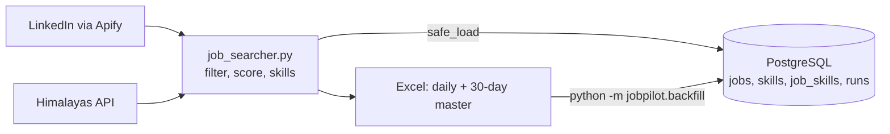

# Daily Job Searcher

Every day at **12:00**, Windows Task Scheduler ("Daily LinkedIn Job Search") runs `job_searcher.py`:

1. Searches, for each title in `config.json` (Internship + Entry level, posted in the past 24h):
   - LinkedIn through Apify: **remote** jobs Worldwide and in the European Union, plus all jobs in Türkiye.
   - Himalayas.app (free API): remote jobs that explicitly accept applicants living in Türkiye (last 72h, only new ones).
2. Drops senior, non-tech and non-remote postings, internship mills (unpaid, pay-to-join, certificate-as-pay) and job aggregators. Marks each job **Open To You? Yes/No**: on LinkedIn, a remote job listed under a country usually means you must live there. Then it detects the skills each posting asks for and compares them with `cv_skills`.
3. Writes `output/daily/jobs_YYYY-MM-DD.xlsx` and updates `output/job_market_master.xlsx` (last 30 days, for the Copilot agent).
4. Loads the same 30-day window into a local **PostgreSQL** database. If the database is down, the run logs one warning line and the Excel files are still written.



| File | Purpose |
|------|---------|
| `config.json` | Search titles, filters, your CV skills, output folder |
| `run_now.cmd` | Double-click to run immediately |
| `logs/run.log` | Check here if a morning's file is missing, or for Postgres warnings |
| `jobpilot/records.py` | Maps one Excel row to a `jobs` record (pure, no database) |
| `jobpilot/db.py` | Upserts into Postgres; `safe_load` is what the daily run calls |
| `jobpilot/backfill.py` | Loads existing Excel files into Postgres |
| `db/init/001_schema.sql` | Database schema (runs once, on the first container start) |
| `COPILOT_AGENT_SETUP.md` | Agent instructions and setup steps |
| `learning_log.md` | Track new skills; upload it to the agent |

- **Cost:** about $0.40–0.45 of Apify credit per run (~$12–14/month); Himalayas is free. The Apify free plan's $5/month runs out after ~11 days, then runs fail until next month (no surprise charges on the free plan). To stay within $5, lower `limit_per_search` in `regions`, e.g. Worldwide 10, EU 10, Türkiye 15.
- **Token:** read from the `APIFY_TOKEN` user environment variable.
- **PC off at 12:00?** The task runs at the next login.
- **Stop it:** Task Scheduler → "Daily LinkedIn Job Search" → Disable.

## Postgres setup (once)

1. Install the Python packages: `python -m pip install -r requirements.txt`. Use the same Python that Task Scheduler runs.
2. Docker Desktop → Settings → General → turn on **Start Docker Desktop when you sign in**. The container has `restart: unless-stopped`, so the database is up before the 12:00 run.
3. Copy `.env.example` to `.env`. Pick a password and put it in both `POSTGRES_PASSWORD` and `DATABASE_URL`. Keep `127.0.0.1` (not `localhost`): it avoids a slow IPv6 attempt. If the password has symbols like `@` or `:`, URL-encode them in `DATABASE_URL`.
4. Start the database: `docker compose up -d`. Check it with `docker compose ps` (should say "healthy").
5. Load the Excel files you already have: `python -m jobpilot.backfill`. With no arguments it loads `output/daily/*.xlsx` oldest first, then the master. You can also pass file paths. It is safe to run again.

SQL shell: `docker compose exec db psql -U jobs -d jobs`.

## Tests

- `python -m pytest -q`: the default suite (140 tests). No network, no Docker.
- `python -m pytest -q -m db`: 13 database tests. They need the container running and work in a throwaway schema, so your real data is not touched.

## Schema in brief

| Table | One row per | Key points |
|-------|-------------|------------|
| `jobs` | job posting | `id` surrogate key; `UNIQUE (source, source_id)` natural key; `first_seen` / `last_seen` run dates; `match_score`, `open_to_you` |
| `skills` | skill name | `category`, and `on_cv` refreshed from `config.json` on every load |
| `job_skills` | job–skill pair | links jobs to skills, so skill trends are a `GROUP BY` |
| `runs` | load | daily or backfill, rows offered and rows written |

Top 10 skills asked for in the last 30 days:

```sql
SELECT s.name, count(*) AS jobs
FROM job_skills js
JOIN skills s ON s.skill_id = js.skill_id
JOIN jobs j   ON j.id = js.job_id
WHERE j.first_seen >= current_date - 30
GROUP BY s.name
ORDER BY jobs DESC, s.name
LIMIT 10;
```

Best matches you can actually apply to:

```sql
SELECT match_score, title, company, work_type, apply_url
FROM jobs
WHERE open_to_you AND match_score >= 70
ORDER BY match_score DESC, last_seen DESC;
```

## Design decisions

**Natural key plus surrogate id.** A job is identified by `(source, source_id)`, e.g. LinkedIn's numeric id. That pair has a `UNIQUE` constraint, so loading the same file twice cannot create duplicates. Foreign keys use a small `BIGINT id` instead, so `job_skills` doesn't repeat long Himalayas URLs. Rejected: using the URL or title as the key (they change or collide).

**Order-independent upsert.** Each load uses `INSERT ... ON CONFLICT DO UPDATE ... WHERE jobs.last_seen <= EXCLUDED.last_seen`. Only data at least as new as what's stored can overwrite it, so a backfill of old files after daily loads can't roll values back. `first_seen` can only move earlier (`LEAST`). Rejected: delete-then-insert, which loses history and breaks foreign keys.

**Load the whole 30-day window every day.** The daily run loads the full master window, not just today's new jobs. If the database was down yesterday, today's run fills the gap by itself. The cost is a few hundred upserts, which is small.

**Fail safe in the daily run.** `safe_load` does the whole load in one transaction, so an error rolls everything back instead of leaving half a batch. The `try` sits outside the `with` block for exactly that reason. It never raises: it logs one redacted line (password and URL hidden) and returns `False`. Connect and statement timeouts (5 s / 30 s) stop a stopped container or a stuck lock from hanging the run. `psycopg` is imported lazily, so a missing driver can't break the Excel output.

**Skip bad rows, not the batch.** The row mapper turns bad content (an unreadable date or score) into `NULL`. Missing identity fields (Run Date, Job ID, Title) raise an error, and the loader skips just that row.

**Fail loud in the backfill.** The backfill is run by hand, so it prints the error and exits with code 1. Each file is its own transaction: a bad file rolls back alone and earlier files stay loaded.

**Opt-in database tests.** Tests marked `db` are skipped by default, so the hook that runs pytest after every edit never needs Docker.

**Microsoft and low-code skills are tracked, not claimed.** Copilot Studio, Power Platform, Azure AI and similar skills are now detected in postings, to measure real demand. They are not in `cv_skills`, so match scores stay honest.

**Left out on purpose (for now):** a migrations tool (needed before the next schema change), tracking whether a job is still listed, de-duplicating the same job across LinkedIn and Himalayas, and storing full descriptions (they are cut at 8,000 characters, as in Excel; revisit for embeddings in roadmap step 4).
