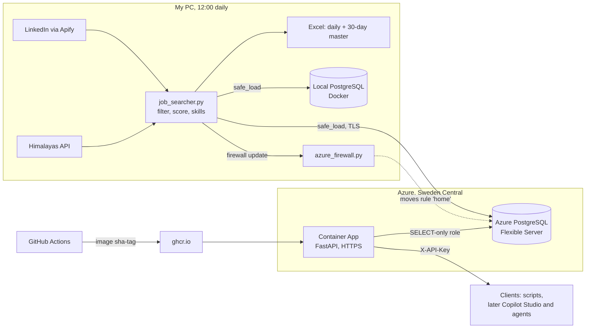

# JobPilot: daily job searcher

JobPilot collects internship and entry-level tech jobs every day, scores how well each one fits my CV, and tracks which skills are in demand. The data lands in Excel, in a local PostgreSQL database and in a PostgreSQL database on Azure. A read-only FastAPI service, deployed on Azure Container Apps over HTTPS, exposes it to tools and LLM agents. Tested with pytest and GitHub Actions CI; runs on Azure free tiers with a $5/month budget alert.

Every day at **12:00**, Windows Task Scheduler ("Daily LinkedIn Job Search") runs `job_searcher.py` on my PC:

1. Searches, for each title in `config.json` (Internship + Entry level, posted in the past 24h):
   - LinkedIn through Apify: **remote** jobs Worldwide and in the European Union, plus all jobs in Türkiye.
   - Himalayas.app (free API): remote jobs that explicitly accept applicants living in Türkiye (last 72h, only new ones).
   - If every source fails with a network error (e.g. Wi-Fi not ready yet after the PC wakes), it waits 120 s and tries again, up to 3 rounds.
2. Drops senior, non-tech and non-remote postings, internship mills (unpaid, pay-to-join, certificate-as-pay) and job aggregators. Marks each job **Open To You? Yes/No**: on LinkedIn, a remote job listed under a country usually means you must live there. Then it detects the skills each posting asks for and compares them with `cv_skills`.
3. Writes `output/daily/jobs_YYYY-MM-DD.xlsx` and updates `output/job_market_master.xlsx` (last 30 days, for the Copilot agent).
4. Loads the same 30-day window into the local **PostgreSQL** database.
5. Points the Azure firewall rule at today's home IP, then loads the same window into **Azure PostgreSQL**.

Steps 4 and 5 fail safe on their own: if a database is down, the run logs one warning line and carries on. Excel is always written.



| File | Purpose |
|------|---------|
| `config.json` | Search titles, filters, your CV skills, output folder, Azure firewall rule |
| `run_now.cmd` | Double-click to run immediately |
| `logs/run.log` | Check here if a morning's file is missing, or for database and firewall warnings |
| `jobpilot/records.py` | Maps one Excel row to a `jobs` record (pure, no database) |
| `jobpilot/db.py` | Batched upserts into Postgres; `safe_load` is what the daily run calls |
| `jobpilot/backfill.py` | Loads existing Excel files into Postgres (`--url-env` picks the database) |
| `jobpilot/azure_firewall.py` | Points the Azure firewall rule at today's home IP before the cloud load |
| `db/migrations/*.sql` | Database schema as numbered migrations (002 adds the SELECT-only API role) |
| `jobpilot/migrate.py` | Applies new migrations in order and records them in `schema_migrations` |
| `jobpilot/queries.py` | The API's read-only SQL (job list and detail, skill demand, run history) |
| `jobpilot/api.py` | FastAPI app: API-key check, input validation, response models |
| `Dockerfile`, `.dockerignore` | The API container image (whitelist: only `jobpilot/` and `requirements-api.txt` go in) |
| `requirements-api.txt` | The API's dependencies, pinned exactly; `requirements.txt` includes it |
| `docs/openapi.json` | Snapshot of the API contract; a test fails if the API drifts from it |
| `.github/workflows/ci.yml` | CI: tests, migrations on a fresh database, database tests; on `main` also builds the image |
| `COPILOT_AGENT_SETUP.md` | Agent instructions and setup steps |
| `learning_log.md` | Track new skills; upload it to the agent |

- **Cost:** about $0.40–0.45 of Apify credit per run (~$12–14/month); Himalayas is free. The Apify free plan's $5/month runs out after ~11 days, then runs fail until next month (no surprise charges on the free plan). To stay within $5, lower `limit_per_search` in `regions`, e.g. Worldwide 10, EU 10, Türkiye 15. Azure costs: see [Deploy to Azure](#deploy-to-azure).
- **Token:** read from the `APIFY_TOKEN` user environment variable.
- **PC off at 12:00?** The task runs at the next login.
- **Stop it:** Task Scheduler → "Daily LinkedIn Job Search" → Disable.

## Postgres setup (once)

1. Install the Python packages: `python -m pip install -r requirements.txt`. Use the same Python that Task Scheduler runs.
2. Docker Desktop → Settings → General → turn on **Start Docker Desktop when you sign in**. The container has `restart: unless-stopped`, so the database is up before the 12:00 run.
3. Copy `.env.example` to `.env`. Pick a password and put it in both `POSTGRES_PASSWORD` and `DATABASE_URL`. Keep `127.0.0.1` (not `localhost`): it avoids a slow IPv6 attempt. If the password has symbols like `@` or `:`, URL-encode them in `DATABASE_URL`.
4. Start the database: `docker compose up -d`. Check it with `docker compose ps` (should say "healthy").
5. Create the tables with `python -m jobpilot.migrate`. It applies every file in `db/migrations/` that hasn't run yet, so run it again after pulling new ones.
   - **Fresh database:** run it as above.
   - **Database created before migrations existed** (by the old `db/init` script): it already has the tables. Run `python -m jobpilot.migrate --baseline` once instead. This records 001 as applied without running it. After that, use the normal command.
6. Load the Excel files you already have: `python -m jobpilot.backfill`. With no arguments it loads `output/daily/*.xlsx` oldest first, then the master. You can also pass file paths. It is safe to run again.

For the Azure database, add `--url-env AZURE_DATABASE_URL` to either command, e.g. `python -m jobpilot.migrate --url-env AZURE_DATABASE_URL`. Never put the Azure URL in `DATABASE_URL`: the tests create and drop throwaway schemas wherever `DATABASE_URL` points.

SQL shell: `docker compose exec db psql -U jobs -d jobs`.

## Run the API locally

Locally the API listens on 127.0.0.1 only, so nothing outside this PC can reach it.

1. Generate a key and put it in `.env` as `JOBPILOT_API_KEY=...`:
   `python -c "import secrets; print(secrets.token_urlsafe(32))"`
   Without a key, every data endpoint answers 503. The API never runs open by accident.
2. Start it (the database must be running):
   `uvicorn jobpilot.api:app --host 127.0.0.1 --port 8000`
3. Open <http://127.0.0.1:8000/docs>, click **Authorize**, paste the key, and try the endpoints. This is the easiest way to use it.
   (`JOBPILOT_DOCS=0` turns off `/docs`, `/redoc` and `/openapi.json`; the container image sets it.)

| Endpoint | Key? | operation_id | Returns |
|----------|------|--------------|---------|
| `GET /health` | no | `health` | `{"status": "ok"}`: the API process is up. It never touches the database; use `/runs` to check that |
| `GET /jobs` | yes | `list_jobs` | One page of jobs, best match first. Filters: `open_to_you`, `min_score`, `skill`, `work_type`, `source`, `since`, `q`; paging: `limit`, `offset`, `has_more` |
| `GET /jobs/{job_id}` | yes | `get_job` | One job with its full description, red flags and skills (with `on_cv`) |
| `GET /skills` | yes | `top_skills` | Most-demanded skills in the last `days` days, with share of jobs and `on_cv` |
| `GET /runs` | yes | `recent_runs` | Latest database loads, newest first |

A request without the key, or with a wrong one, gets 401. A query that hits the 30 s statement timeout gets 504.

From a terminal: the server reads `.env` itself, but your shell doesn't. Copy the key into the session without printing it:

```powershell
# PowerShell, from the project folder: sets the variable for this window only, prints nothing
$env:JOBPILOT_API_KEY = (Select-String -Path .env -Pattern '^JOBPILOT_API_KEY=(.*)$').Matches[0].Groups[1].Value.Trim()

Invoke-RestMethod -Headers @{"X-API-Key"=$env:JOBPILOT_API_KEY} "http://127.0.0.1:8000/jobs?open_to_you=true&limit=3"
```

```bash
# Git Bash
export JOBPILOT_API_KEY="$(grep '^JOBPILOT_API_KEY=' .env | cut -d= -f2-)"
curl -s -H "X-API-Key: $JOBPILOT_API_KEY" "http://127.0.0.1:8000/runs?limit=5"
```

If you change an endpoint, regenerate the contract with `python -m jobpilot.api --write` and commit `docs/openapi.json`.
Then regenerate the Power Platform (Swagger 2.0) copy with `python -m jobpilot.openapi2 --write` and commit `docs/openapi-v2.json`.

## Deploy to Azure

### What exists

All in resource group `rg-jobpilot`, region **Sweden Central**, on a personal pay-as-you-go subscription.

| Resource | Name | Size | Cost |
|----------|------|------|------|
| PostgreSQL Flexible Server | `psql-jobpilot-kk` | PostgreSQL 17, Burstable B1ms, 32 GiB storage, 7-day backups; no HA, geo-backup, storage autogrow or Defender | Free for 12 months (750 h B1ms + 32 GB per month) |
| Container Apps environment | `cae-jobpilot` | Consumption plan, no Log Analytics | Free within the monthly Consumption grant |
| Container App | `ca-jobpilot-api` | 0.25 vCPU / 0.5 GiB, min 0 / max 1 replica, HTTPS only, target port 8000 | Free within the grant; scales to zero when idle |
| Image | `ghcr.io/kaankababulut/jobpilot-api` | Public GitHub package, tags `sha-<commit>` and `main` | Free |
| Budget | on the subscription | $5/month; email alerts at 50% and 100% actual, 100% forecast | Free |

Live API: <https://ca-jobpilot-api.kindpebble-9d30ee27.swedencentral.azurecontainerapps.io> (`/health` needs no key; `/docs` is off).

The database lives in Sweden Central because Germany West Central refused new PostgreSQL servers for new subscriptions. Both the local database and CI also run PostgreSQL 17.

### Deploy a new version

1. Merge the pull request into `main`. CI runs the tests, then builds the image and pushes it as `sha-<full commit hash>` (and `main`). Nothing untested becomes an image.
2. Find the tag: GitHub → the repo → Packages → `jobpilot-api`, or `git rev-parse origin/main` after a `git pull`.
3. Azure portal → Container App `ca-jobpilot-api` → **Containers** → **Edit and deploy** → select the container → change the image tag to the new `sha-...` → **Save** → **Create**. A new revision starts and takes over the traffic.
   (CLI equivalent: `az containerapp update -n ca-jobpilot-api -g rg-jobpilot --image ghcr.io/kaankababulut/jobpilot-api:sha-<hash>`.)
4. Check it: `/health` answers 200, and `/jobs` with the key answers 200 (see [Call the live API](#call-the-live-api)). The first request after an idle period is slower, because the app starts from zero.

**Roll back:** repeat step 3 with the previous `sha-...` tag. Tags never move, so an old tag is exactly the old build. Don't deploy the `main` tag: you couldn't tell which build is running.

**Schema change:** apply the new migration to Azure before deploying code that needs it: `python -m jobpilot.migrate --url-env AZURE_DATABASE_URL`. New tables also need a `GRANT SELECT` to `jobpilot_api` in that migration.

### Secrets

| Secret | Lives in | Used by |
|--------|----------|---------|
| Admin URL of the Azure database | `.env` → `AZURE_DATABASE_URL` | the daily run, `migrate`, `backfill` |
| `database-url` (connects as the read-only `jobpilot_api` role) | Container App → **Secrets** → env var `DATABASE_URL` | the deployed API |
| `api-key` (the cloud API key, different from the local one) | Container App → **Secrets** → env var `JOBPILOT_API_KEY`; my copy in `.env` → `JOBPILOT_CLOUD_API_KEY` | the deployed API; my scripts |
| Firewall updater client secret | `.env` → `AZURE_CLIENT_SECRET` (expires after 12 months) | `azure_firewall.py` |

No secret is in the image, in git or in CI. CI pushes images with the short-lived `GITHUB_TOKEN`.

Never type or paste a password into psql's hidden prompt (`\password`) through `docker exec`: it silently changed the password twice. Never screenshot the Secrets page with values shown. If a secret was ever visible, rotate it.

**Rotate the cloud API key.** A secret change doesn't restart the running app, so finish with a restart.

1. Create a key straight onto the clipboard, without printing it:
   `python -c "import secrets, subprocess; subprocess.run('clip', input=secrets.token_urlsafe(32), text=True, check=True)"`
2. Container App → **Secrets** → `api-key` → Edit → paste → Save.
3. Paste the same value into `.env` as `JOBPILOT_CLOUD_API_KEY` (and later into any Copilot Studio connector).
4. Container App → **Revisions and replicas** → active revision → **Restart**. The old key now gets 401.

**Rotate the `jobpilot_api` password.** The script sets a random password through the admin connection and puts the new API database URL on the clipboard. From home, so the firewall lets you in (run `python -m jobpilot.azure_firewall` first if your IP changed). The old password stops working at once, so do all steps in one go.

```powershell
# PowerShell, from the project folder; prints no secret
@'
import os, secrets, subprocess
from urllib.parse import urlsplit
import psycopg
from psycopg import sql
from dotenv import load_dotenv
load_dotenv(".env")
admin = urlsplit(os.environ["AZURE_DATABASE_URL"])
pw = secrets.token_urlsafe(32)  # URL-safe characters: no encoding needed in the URL
with psycopg.connect(admin.geturl(), connect_timeout=10) as conn:
    conn.execute(sql.SQL("ALTER ROLE jobpilot_api LOGIN PASSWORD {}").format(sql.Literal(pw)))
url = f"postgresql://jobpilot_api:{pw}@{admin.hostname}:5432{admin.path}?sslmode=require"
subprocess.run("clip", input=url, text=True, check=True)
print("jobpilot_api password changed; the new DATABASE_URL is on the clipboard")
'@ | python -
```

Then: Container App → **Secrets** → `database-url` → Edit → paste → Save → restart the active revision → check `/jobs` answers 200. Clear the clipboard afterwards (copy any other text).

**Firewall updater secret:** see [Azure firewall auto-update](#azure-firewall-auto-update).

### Call the live API

```powershell
# PowerShell, from the project folder: reads the cloud key from .env, prints nothing
$env:JOBPILOT_CLOUD_API_KEY = (Select-String -Path .env -Pattern '^JOBPILOT_CLOUD_API_KEY=(.*)$').Matches[0].Groups[1].Value.Trim()
$base = "https://ca-jobpilot-api.kindpebble-9d30ee27.swedencentral.azurecontainerapps.io"

Invoke-RestMethod "$base/health"
Invoke-RestMethod -Headers @{"X-API-Key"=$env:JOBPILOT_CLOUD_API_KEY} "$base/jobs?open_to_you=true&limit=3"
Invoke-RestMethod -Headers @{"X-API-Key"=$env:JOBPILOT_CLOUD_API_KEY} "$base/runs?limit=3"
```

```bash
# Git Bash
export JOBPILOT_CLOUD_API_KEY="$(grep '^JOBPILOT_CLOUD_API_KEY=' .env | cut -d= -f2-)"
BASE=https://ca-jobpilot-api.kindpebble-9d30ee27.swedencentral.azurecontainerapps.io
curl -s -H "X-API-Key: $JOBPILOT_CLOUD_API_KEY" "$BASE/skills?days=30&limit=5"
```

Checked on 2026-10-04: `/health` 200; `/docs` and `/openapi.json` 404; `/jobs` 401 without the key and 200 in about 0.5 s with it; `/runs` shows the daily load; plain `http://` redirects to `https://`.

### Cost guardrails

- **Budget:** $5/month on the subscription, with email alerts at 50% and 100% of actual spend and at 100% of forecast. An alert doesn't stop anything; it tells me to act.
- **Max 1 replica:** a flood of requests can't scale the app (and the bill) up.
- **Scale to zero:** with no traffic the app runs no replicas and costs nothing. The price is a slower first request (a cold start).
- **No paid extras:** no high availability, geo-backup, storage autogrow, Defender or Log Analytics. The portal forced a Log Analytics workspace when the environment was created; logging is set to "Don't save logs" so nothing is ingested and billed.
- **Free tier ends around Sep 2027.** After 12 months the B1ms server becomes a paid resource. Decide before then: delete it, stop it, or move the database somewhere cheaper. Put a calendar reminder next to the client-secret one.

### Kill switch

- **Take the API offline, keep everything:** Container App → **Ingress** → untick **Enabled** → Save. Turn it on again the same way.
- **Remove everything and all costs:** delete the resource group `rg-jobpilot`. This deletes the database too; the local database and Excel files still hold the data, and `python -m jobpilot.backfill --url-env AZURE_DATABASE_URL` can refill a new one.

## Azure firewall auto-update

The home IP changes almost daily, and Azure's firewall silently drops connections from any IP it doesn't list, so the cloud load would just time out. Before the Azure load, the 12:00 run points the firewall rule `home` (set in `config.json` → `azure_firewall`) at today's public IP, then waits up to about 3 minutes for the database to answer (a TCP probe). If anything fails, it logs one line and the run carries on. A real log line: `rule home <old> -> <new>; database reachable after 3s`, then `Azure Postgres: wrote 428 of 428 jobs`.

- **Identity:** the Entra app `jobpilot-firewall-updater` signs in with a client secret. Its only permission is the custom role `JobPilot Firewall Rule Updater` (read and write `flexibleServers/firewallRules`, nothing else), assigned on `psql-jobpilot-kk` only. A leaked secret can move that one rule and nothing more.
- **.env:** `AZURE_TENANT_ID`, `AZURE_CLIENT_ID`, `AZURE_CLIENT_SECRET`, `AZURE_SUBSCRIPTION_ID` (plus `AZURE_DATABASE_URL`, for the host). If any is blank, the update is skipped.
- **Test it (from home):** `python -m jobpilot.azure_firewall`. It prints one line and exits 0 when the database is reachable.
- **Secret expired** (the log says "client secret expired"): Entra ID → App registrations → `jobpilot-firewall-updater` → Certificates & secrets → New client secret → copy the **Value** into `.env` as `AZURE_CLIENT_SECRET` → delete the old secret → set a calendar reminder for the new expiry date.

## Tests and CI

- `python -m pytest -q`: the default suite (308 tests). No network, no Docker.
- `python -m pytest -q -m db`: 63 database tests. They need the container running and work in a throwaway schema, so your real data is not touched. Locally they skip if the database is down.

GitHub Actions (`.github/workflows/ci.yml`) runs on every pull request and on pushes to `main`:

1. The default tests.
2. `python -m jobpilot.migrate` against a fresh Postgres + pgvector service container, which proves the migrations build the schema from nothing.
3. The database tests, with `JOBPILOT_REQUIRE_DB=1`, so an unreachable database fails the build instead of skipping silently.
4. On `main` only, after the tests pass: build the API image and push it to ghcr.io with a `sha-<commit>` tag.

## Schema in brief

| Table | One row per | Key points |
|-------|-------------|------------|
| `jobs` | job posting | `id` surrogate key; `UNIQUE (source, source_id)` natural key; `first_seen` / `last_seen` run dates; `match_score`, `open_to_you` |
| `skills` | skill name | `category`, and `on_cv` refreshed from `config.json` on every load |
| `job_skills` | job–skill pair | links jobs to skills, so skill trends are a `GROUP BY` |
| `runs` | load | daily or backfill, rows offered and rows written |
| `schema_migrations` | applied migration | version, name, `applied_at` |

Role `jobpilot_api` (migration 002): `SELECT` on the four data tables only, read-only by default, at most 5 connections. The deployed API logs in as this role.

Top 10 skills asked for in the last 30 days (also `GET /skills`):

```sql
SELECT s.name, count(*) AS jobs
FROM job_skills js
JOIN skills s ON s.skill_id = js.skill_id
JOIN jobs j   ON j.id = js.job_id
WHERE j.first_seen >= current_date - 30
GROUP BY s.name
ORDER BY jobs DESC, s.name
LIMIT 10;
```

Best matches you can actually apply to (also `GET /jobs?open_to_you=true&min_score=70`):

```sql
SELECT match_score, title, company, work_type, apply_url
FROM jobs
WHERE open_to_you AND match_score >= 70
ORDER BY match_score DESC, last_seen DESC;
```

## Design decisions

### Loading data (roadmap step 2)

**Natural key plus surrogate id.** A job is identified by `(source, source_id)`, e.g. LinkedIn's numeric id. That pair has a `UNIQUE` constraint, so loading the same file twice cannot create duplicates. Foreign keys use a small `BIGINT id` instead, so `job_skills` doesn't repeat long Himalayas URLs. Rejected: using the URL or title as the key (they change or collide).

**Order-independent upsert.** Each load uses `INSERT ... ON CONFLICT DO UPDATE ... WHERE jobs.last_seen <= EXCLUDED.last_seen`. Only data at least as new as what's stored can overwrite it, so a backfill of old files after daily loads can't roll values back. `first_seen` can only move earlier (`LEAST`). Rejected: delete-then-insert, which loses history and breaks foreign keys.

**Load the whole 30-day window every day.** The daily run loads the full master window, not just today's new jobs. If the database was down yesterday, today's run fills the gap by itself. The cost is a few hundred upserts, which is small.

**Fail safe in the daily run.** `safe_load` does the whole load in one transaction, so an error rolls everything back instead of leaving half a batch. The `try` sits outside the `with` block for exactly that reason. It never raises: it logs one redacted line (password and URL hidden) and returns `False`. Connect and statement timeouts (5 s / 30 s) stop a stopped container or a stuck lock from hanging the run. `psycopg` is imported lazily, so a missing driver can't break the Excel output.

**Skip bad rows, not the batch.** The row mapper turns bad content (an unreadable date or score) into `NULL`. Missing identity fields (Run Date, Job ID, Title) raise an error, and the loader skips just that row.

**Fail loud in the backfill.** The backfill is run by hand, so it prints the error and exits with code 1. Each file is its own transaction: a bad file rolls back alone and earlier files stay loaded.

**Microsoft and low-code skills are tracked, not claimed.** Copilot Studio, Power Platform, Azure AI and similar skills are detected in postings, to measure real demand. They are not in `cv_skills`, so match scores stay honest.

### API foundation (roadmap step 3)

**Plain-SQL migrations with a small homegrown runner.** Every schema change is a new numbered file in `db/migrations/`; an applied file is never edited. Each file runs in its own transaction and is recorded in `schema_migrations`, so re-running applies only what's new and a failing file leaves nothing behind. The runner is one tested file of under 200 lines. Rejected: Alembic (built around SQLAlchemy, which this project doesn't use, and heavy for one developer) and Docker init scripts (they only run on an empty volume, so they can't change an existing database). The init mount is removed from `docker-compose.yml`, so the schema has one source of truth.

**Baseline instead of rebuilding.** My database was created by the old init script and already held 270 jobs. `--baseline` records 001 as applied without running it, so the real data stays. It refuses if the `jobs` table doesn't exist, so it can't hide a migration that never ran. Rejected: wiping the volume and backfilling again.

**CI with a real Postgres.** GitHub Actions starts the same `pgvector/pgvector:pg17` image as a service container, builds it with the migrations, then runs the database tests. Locally, database tests skip when Docker is off, which is convenient. In CI a skip would look like a pass, so `JOBPILOT_REQUIRE_DB=1` turns it into a failure. Rejected: mocking the database (it wouldn't catch real SQL errors).

**API key, failing closed.** Callers send an `X-API-Key` header that must match `JOBPILOT_API_KEY`. If the key isn't set, data endpoints return 503 rather than running open. The check uses `secrets.compare_digest`, which takes the same time however many characters match, so response timing can't leak the key. The key check runs before the database connection opens. Rejected: OAuth, which is a lot of moving parts for one user. Copilot Studio and Power Platform custom connectors support API-key auth, which is where this API is going.

**Read-only in three layers.** The code only runs `SELECT`, with values passed as `%s` parameters. The API's connections are opened with `default_transaction_read_only=on`, so Postgres rejects a write even if a bug slips into the code. In Azure the API also logs in as the SELECT-only role `jobpilot_api` (see step 4).

**One short connection per request, no pool, no async.** Each request opens a read-only connection in autocommit mode and closes it when the response is sent. Autocommit means even a `SELECT` never leaves the connection "idle in transaction", holding a snapshot and locks. Endpoints are plain `def`: psycopg calls block, and FastAPI runs sync endpoints in a thread pool. Rejected for now: a connection pool and async code. With one user and a few hundred rows they add complexity and save nothing measurable.

**Paging with `has_more`.** `/jobs` asks the database for `limit + 1` rows. If the extra row comes back, there is another page. This avoids a second `count(*)` query. The sort ends with `id`, so paging with `OFFSET` never repeats or skips a job. `offset` is capped at 10,000.

**Written for LLM tools.** Each endpoint has a stable `operation_id` (`list_jobs`, `get_job`, `top_skills`, ...) and a description that says when to use it. Agents and Copilot Studio use these as tool names and read the descriptions to pick a tool. Filters like `work_type` are enums, so a typo gets a 422 instead of silently returning nothing. Response models are flat, because Power Platform imports OpenAPI 2.0 and handles simple schemas best.

### Azure deployment (roadmap step 4)

**Managed services on free tiers.** The database is Azure Database for PostgreSQL Flexible Server (B1ms, free for 12 months) and the API runs on Azure Container Apps (Consumption plan). Azure handles patching, backups and HTTPS certificates. Rejected: a virtual machine (I'd have to patch and secure the OS myself) and Kubernetes (far too much for one container).

**Same PostgreSQL version everywhere.** Local Docker, CI and Azure all run PostgreSQL 17. A query that works in tests works in production; a version gap is a class of bug I don't have to think about.

**A second load target, not a sync.** The daily run loads the same 30-day window into the local database and then into Azure, each through `safe_load`, each failing safe on its own. A missed cloud day fills itself the next day. Rejected: copying the local database to the cloud (another moving part) and loading only into the cloud (the local database is my dev copy and my backup).

**Batched upserts for a remote database.** Row by row, each job cost about 4 network round trips, which is nothing on localhost but slow across the internet: the first backfill into Azure took 4 minutes for 339 jobs. `upsert_jobs` now sends each statement group with psycopg's pipelined `executemany`, and inserts all job-skill links in one `unnest` statement. A batch costs about 16 round trips in total. The next backfill took 19 s for 389 jobs. The per-row logic (which update wins, `first_seen` only moving earlier) is unchanged and still tested.

**A SELECT-only database role.** Migration 002 creates `jobpilot_api`: `SELECT` on the four data tables, nothing on `schema_migrations`, read-only by default, at most 5 connections so the API can't use up the server's slots and block the daily load. A read-only session setting can be switched off by the client; a missing privilege can't. Rejected: letting the API use the admin login. The daily loader still uses the admin login (see left out).

**Firewall: "Allow Azure services", with compensating controls.** The plan was to allow only my home IP and the Container App's outbound IPs. But Container Apps on the Consumption plan sends traffic from a shared pool of about 170 IPs, more than the firewall's rule limit of about 128. A fixed outbound IP (NAT gateway, about $30/month) or a private network link (VNet plus private endpoint, about $7/month) would blow the $5 budget. So the server allows Azure services, and relies on long random passwords, TLS (`sslmode=require`) and the least-privilege role. In production with a budget I'd use VNet integration and a private endpoint, so the database has no public address at all.

**Firewall automation with a least-privilege identity.** My home IP changes almost daily. The run updates one firewall rule through the Azure management API, signed in as an Entra app whose only permission is a custom role with two actions (read and write firewall rules), assigned on this one server. Rejected: a built-in role like Contributor (a leaked secret could change or delete anything) and opening the firewall to a wide IP range.

**Retry when the whole network is down.** One day was lost because the PC woke at 12:00 and Wi-Fi said "connected" before traffic actually flowed. The fetch now retries the whole round (up to 3 rounds, 120 s apart), but only if every source failed with a network error. An HTTP error, like a bad token, means the server answered, so it isn't retried, and a search that already succeeded is never paid for twice.

**Immutable image tags, built only after tests pass.** CI builds the image on `main` only, after all tests pass, and tags it with the commit hash. A tag never moves, so I always know which code is running and rollback means picking an older tag. The image is a public GitHub package: Azure pulls it without a registry password. I made it public only after checking the image's file list: it holds only `jobpilot/*.py` and the requirements file. Rejected: Azure Container Registry (costs money) and deploying the moving `main` tag.

**A small, closed image.** `.dockerignore` is a whitelist: it ignores everything, then lets in only `jobpilot/` and `requirements-api.txt`. A secret file added later can't slip in by accident. The app runs as a non-root user, uvicorn doesn't send a `server` header, and dependencies are pinned exactly in `requirements-api.txt`, which `requirements.txt` includes, so CI tests the versions that ship. The image sets `JOBPILOT_DOCS=0`: the docs are off unless someone deliberately turns them on (fail closed). `docs/openapi.json` stays in the repo as the contract, checked by a test.

**Production behaviour in the API.** `/health` never touches the database, so Azure's health checks and a cold database can't take each other down; `/runs` shows whether data is flowing. A query that hits the statement timeout returns 504 (the database is up, the query was slow) instead of a generic 500.

**Secrets in Container Apps secrets.** The database URL and the cloud API key are Container Apps secrets, exposed to the app as `DATABASE_URL` and `JOBPILOT_API_KEY`. The cloud key is different from the local one, so a leak of one doesn't open the other. Rejected for now: Azure Key Vault (another resource to secure for two values).

**Manual deploys.** A deploy is a new revision with a new `sha-` tag, in the portal or with `az containerapp update`. It takes a minute and I deploy rarely. Rejected for now: deploying from GitHub Actions, which needs an Azure identity for CI (OIDC federation) and is more to secure than it saves.

**Left out on purpose (for now):**
- VNet integration and a private endpoint for the database: the production answer, over budget here.
- A separate writer role for the daily loader: it still uses the admin login, from my PC only.
- Automatic deploys from GitHub Actions (OIDC), Azure Key Vault, a custom domain.
- Rate limiting or API Management: max 1 replica and the API key cover one user.
- Log Analytics: it bills per GB ingested, and one user doesn't need stored logs.
- Connection pool, async endpoints and a total count in paging: not needed for one user.
- Write endpoints and multiple users or OAuth.
- Tracking whether a job is still listed, and de-duplicating the same job across LinkedIn and Himalayas.
- Full descriptions: they are cut at 8,000 characters, as in Excel. Revisit with embeddings in roadmap step 7.
