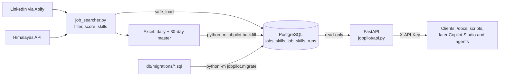

# JobPilot: daily job searcher

JobPilot collects internship and entry-level tech jobs every day, scores how well each one fits my CV, and tracks which skills are in demand. The data lands in Excel and in PostgreSQL, and a read-only FastAPI service exposes it to tools and LLM agents. Tested with pytest and GitHub Actions CI.

Every day at **12:00**, Windows Task Scheduler ("Daily LinkedIn Job Search") runs `job_searcher.py`:

1. Searches, for each title in `config.json` (Internship + Entry level, posted in the past 24h):
   - LinkedIn through Apify: **remote** jobs Worldwide and in the European Union, plus all jobs in Türkiye.
   - Himalayas.app (free API): remote jobs that explicitly accept applicants living in Türkiye (last 72h, only new ones).
2. Drops senior, non-tech and non-remote postings, internship mills (unpaid, pay-to-join, certificate-as-pay) and job aggregators. Marks each job **Open To You? Yes/No**: on LinkedIn, a remote job listed under a country usually means you must live there. Then it detects the skills each posting asks for and compares them with `cv_skills`.
3. Writes `output/daily/jobs_YYYY-MM-DD.xlsx` and updates `output/job_market_master.xlsx` (last 30 days, for the Copilot agent).
4. Loads the same 30-day window into a local **PostgreSQL** database. If the database is down, the run logs one warning line and the Excel files are still written.



| File | Purpose |
|------|---------|
| `config.json` | Search titles, filters, your CV skills, output folder |
| `run_now.cmd` | Double-click to run immediately |
| `logs/run.log` | Check here if a morning's file is missing, or for Postgres warnings |
| `jobpilot/records.py` | Maps one Excel row to a `jobs` record (pure, no database) |
| `jobpilot/db.py` | Upserts into Postgres; `safe_load` is what the daily run calls |
| `jobpilot/backfill.py` | Loads existing Excel files into Postgres |
| `db/migrations/*.sql` | Database schema as numbered migrations |
| `jobpilot/migrate.py` | Applies new migrations in order and records them in `schema_migrations` |
| `jobpilot/queries.py` | The API's read-only SQL (job list and detail, skill demand, run history) |
| `jobpilot/api.py` | FastAPI app: API-key check, input validation, response models |
| `.github/workflows/ci.yml` | CI: tests, migrations on a fresh database, database tests |
| `COPILOT_AGENT_SETUP.md` | Agent instructions and setup steps |
| `learning_log.md` | Track new skills; upload it to the agent |

- **Cost:** about $0.40–0.45 of Apify credit per run (~$12–14/month); Himalayas is free. The Apify free plan's $5/month runs out after ~11 days, then runs fail until next month (no surprise charges on the free plan). To stay within $5, lower `limit_per_search` in `regions`, e.g. Worldwide 10, EU 10, Türkiye 15.
- **Token:** read from the `APIFY_TOKEN` user environment variable.
- **PC off at 12:00?** The task runs at the next login.
- **Stop it:** Task Scheduler → "Daily LinkedIn Job Search" → Disable.

## Postgres setup (once)

1. Install the Python packages: `python -m pip install -r requirements.txt`. Use the same Python that Task Scheduler runs.
2. Docker Desktop → Settings → General → turn on **Start Docker Desktop when you sign in**. The container has `restart: unless-stopped`, so the database is up before the 12:00 run.
3. Copy `.env.example` to `.env`. Pick a password and put it in both `POSTGRES_PASSWORD` and `DATABASE_URL`. Keep `127.0.0.1` (not `localhost`): it avoids a slow IPv6 attempt. If the password has symbols like `@` or `:`, URL-encode them in `DATABASE_URL`.
4. Start the database: `docker compose up -d`. Check it with `docker compose ps` (should say "healthy").
5. Create the tables with `python -m jobpilot.migrate`. It applies every file in `db/migrations/` that hasn't run yet, so run it again after pulling new ones.
   - **Fresh database:** run it as above.
   - **Database created before migrations existed** (by the old `db/init` script): it already has the tables. Run `python -m jobpilot.migrate --baseline` once instead. This records 001 as applied without running it. After that, use the normal command.
6. Load the Excel files you already have: `python -m jobpilot.backfill`. With no arguments it loads `output/daily/*.xlsx` oldest first, then the master. You can also pass file paths. It is safe to run again.

SQL shell: `docker compose exec db psql -U jobs -d jobs`.

## Run the API

The API is read-only and listens on 127.0.0.1 only, so nothing outside this PC can reach it.

1. Generate a key and put it in `.env` as `JOBPILOT_API_KEY=...`:
   `python -c "import secrets; print(secrets.token_urlsafe(32))"`
   Without a key, every data endpoint answers 503. The API never runs open by accident.
2. Start it (the database must be running):
   `uvicorn jobpilot.api:app --host 127.0.0.1 --port 8000`
3. Open <http://127.0.0.1:8000/docs>, click **Authorize**, paste the key, and try the endpoints. This is the easiest way to use it.
   (`JOBPILOT_DOCS=0` turns off `/docs`, `/redoc` and `/openapi.json`; the deployed image sets it.)

| Endpoint | Key? | operation_id | Returns |
|----------|------|--------------|---------|
| `GET /health` | no | `health` | `{"status": "ok"}`: the API process is up. It never touches the database; use `/runs` to check that |
| `GET /jobs` | yes | `list_jobs` | One page of jobs, best match first. Filters: `open_to_you`, `min_score`, `skill`, `work_type`, `source`, `since`, `q`; paging: `limit`, `offset`, `has_more` |
| `GET /jobs/{job_id}` | yes | `get_job` | One job with its full description, red flags and skills (with `on_cv`) |
| `GET /skills` | yes | `top_skills` | Most-demanded skills in the last `days` days, with share of jobs and `on_cv` |
| `GET /runs` | yes | `recent_runs` | Latest database loads, newest first |

From a terminal: the server reads `.env` itself, but your shell doesn't. Copy the key into the session without printing it:

```powershell
# PowerShell, from the project folder: sets the variable for this window only, prints nothing
$env:JOBPILOT_API_KEY = (Select-String -Path .env -Pattern '^JOBPILOT_API_KEY=(.*)$').Matches[0].Groups[1].Value.Trim()

Invoke-RestMethod -Headers @{"X-API-Key"=$env:JOBPILOT_API_KEY} "http://127.0.0.1:8000/jobs?open_to_you=true&limit=3"
Invoke-RestMethod -Headers @{"X-API-Key"=$env:JOBPILOT_API_KEY} "http://127.0.0.1:8000/skills?days=30&limit=10"
```

```bash
# Git Bash
export JOBPILOT_API_KEY="$(grep '^JOBPILOT_API_KEY=' .env | cut -d= -f2-)"
curl -s -H "X-API-Key: $JOBPILOT_API_KEY" "http://127.0.0.1:8000/runs?limit=5"
```

A request without the key, or with a wrong one, gets 401.

## Azure firewall auto-update

The home IP changes almost daily, and Azure's firewall silently drops connections from any IP it doesn't list, so the cloud load would just time out. Before the Azure load, the 12:00 run points the firewall rule `home` (set in `config.json` → `azure_firewall`) at today's public IP, then waits up to about 3 minutes for the database to answer. If anything fails, it logs one line and the run carries on.

- **Identity:** the Entra app `jobpilot-firewall-updater` signs in with a client secret. Its only permission is the custom role `JobPilot Firewall Rule Updater` (read and write `flexibleServers/firewallRules`, nothing else), assigned on `psql-jobpilot-kk` only. A leaked secret can move that one rule and nothing more.
- **.env:** `AZURE_TENANT_ID`, `AZURE_CLIENT_ID`, `AZURE_CLIENT_SECRET`, `AZURE_SUBSCRIPTION_ID` (plus `AZURE_DATABASE_URL`, for the host). If any is blank, the update is skipped.
- **Test it (from home):** `python -m jobpilot.azure_firewall`. It prints one line and exits 0 when the database is reachable.
- **Secret expired** (the log says "client secret expired"): Entra ID → App registrations → `jobpilot-firewall-updater` → Certificates & secrets → New client secret → copy the **Value** into `.env` as `AZURE_CLIENT_SECRET` → delete the old secret → set a calendar reminder for the new expiry date.

## Tests and CI

- `python -m pytest -q`: the default suite (242 tests). No network, no Docker.
- `python -m pytest -q -m db`: 56 database tests. They need the container running and work in a throwaway schema, so your real data is not touched. Locally they skip if the database is down.

GitHub Actions (`.github/workflows/ci.yml`) runs on every pull request and on pushes to `main`:

1. The default tests.
2. `python -m jobpilot.migrate` against a fresh Postgres + pgvector service container, which proves the migrations build the schema from nothing.
3. The database tests, with `JOBPILOT_REQUIRE_DB=1`, so an unreachable database fails the build instead of skipping silently.

## Schema in brief

| Table | One row per | Key points |
|-------|-------------|------------|
| `jobs` | job posting | `id` surrogate key; `UNIQUE (source, source_id)` natural key; `first_seen` / `last_seen` run dates; `match_score`, `open_to_you` |
| `skills` | skill name | `category`, and `on_cv` refreshed from `config.json` on every load |
| `job_skills` | job–skill pair | links jobs to skills, so skill trends are a `GROUP BY` |
| `runs` | load | daily or backfill, rows offered and rows written |
| `schema_migrations` | applied migration | version, name, `applied_at` |

Top 10 skills asked for in the last 30 days (also `GET /skills`):

```sql
SELECT s.name, count(*) AS jobs
FROM job_skills js
JOIN skills s ON s.skill_id = js.skill_id
JOIN jobs j   ON j.id = js.job_id
WHERE j.first_seen >= current_date - 30
GROUP BY s.name
ORDER BY jobs DESC, s.name
LIMIT 10;
```

Best matches you can actually apply to (also `GET /jobs?open_to_you=true&min_score=70`):

```sql
SELECT match_score, title, company, work_type, apply_url
FROM jobs
WHERE open_to_you AND match_score >= 70
ORDER BY match_score DESC, last_seen DESC;
```

## Design decisions

### Loading data (roadmap step 2)

**Natural key plus surrogate id.** A job is identified by `(source, source_id)`, e.g. LinkedIn's numeric id. That pair has a `UNIQUE` constraint, so loading the same file twice cannot create duplicates. Foreign keys use a small `BIGINT id` instead, so `job_skills` doesn't repeat long Himalayas URLs. Rejected: using the URL or title as the key (they change or collide).

**Order-independent upsert.** Each load uses `INSERT ... ON CONFLICT DO UPDATE ... WHERE jobs.last_seen <= EXCLUDED.last_seen`. Only data at least as new as what's stored can overwrite it, so a backfill of old files after daily loads can't roll values back. `first_seen` can only move earlier (`LEAST`). Rejected: delete-then-insert, which loses history and breaks foreign keys.

**Load the whole 30-day window every day.** The daily run loads the full master window, not just today's new jobs. If the database was down yesterday, today's run fills the gap by itself. The cost is a few hundred upserts, which is small.

**Fail safe in the daily run.** `safe_load` does the whole load in one transaction, so an error rolls everything back instead of leaving half a batch. The `try` sits outside the `with` block for exactly that reason. It never raises: it logs one redacted line (password and URL hidden) and returns `False`. Connect and statement timeouts (5 s / 30 s) stop a stopped container or a stuck lock from hanging the run. `psycopg` is imported lazily, so a missing driver can't break the Excel output.

**Skip bad rows, not the batch.** The row mapper turns bad content (an unreadable date or score) into `NULL`. Missing identity fields (Run Date, Job ID, Title) raise an error, and the loader skips just that row.

**Fail loud in the backfill.** The backfill is run by hand, so it prints the error and exits with code 1. Each file is its own transaction: a bad file rolls back alone and earlier files stay loaded.

**Microsoft and low-code skills are tracked, not claimed.** Copilot Studio, Power Platform, Azure AI and similar skills are detected in postings, to measure real demand. They are not in `cv_skills`, so match scores stay honest.

### API foundation (roadmap step 3)

**Plain-SQL migrations with a small homegrown runner.** Every schema change is a new numbered file in `db/migrations/`; an applied file is never edited. Each file runs in its own transaction and is recorded in `schema_migrations`, so re-running applies only what's new and a failing file leaves nothing behind. The runner is one tested file of under 200 lines. Rejected: Alembic (built around SQLAlchemy, which this project doesn't use, and heavy for one developer) and Docker init scripts (they only run on an empty volume, so they can't change an existing database). The init mount is removed from `docker-compose.yml`, so the schema has one source of truth.

**Baseline instead of rebuilding.** My database was created by the old init script and already held 270 jobs. `--baseline` records 001 as applied without running it, so the real data stays. It refuses if the `jobs` table doesn't exist, so it can't hide a migration that never ran. Rejected: wiping the volume and backfilling again.

**CI with a real Postgres.** GitHub Actions starts the same `pgvector/pgvector:pg17` image as a service container, builds it with the migrations, then runs the database tests. Locally, database tests skip when Docker is off, which is convenient. In CI a skip would look like a pass, so `JOBPILOT_REQUIRE_DB=1` turns it into a failure. Rejected: mocking the database (it wouldn't catch real SQL errors).

**API key, failing closed.** Callers send an `X-API-Key` header that must match `JOBPILOT_API_KEY`. If the key isn't set, data endpoints return 503 rather than running open. The check uses `secrets.compare_digest`, which takes the same time however many characters match, so response timing can't leak the key. The key check runs before the database connection opens. Rejected: OAuth, which is a lot of moving parts for one user. Copilot Studio and Power Platform custom connectors support API-key auth, which is where this API is going.

**Read-only in two layers.** The code only runs `SELECT`, with values passed as `%s` parameters. The API's connections are also opened with `default_transaction_read_only=on`, so Postgres itself rejects a write even if a bug slips into the code. In Azure (step 4) a SELECT-only database role will add a third layer.

**One short connection per request, no pool, no async.** Each request opens a read-only connection in autocommit mode and closes it when the response is sent. Autocommit means even a `SELECT` never leaves the connection "idle in transaction", holding a snapshot and locks. Endpoints are plain `def`: psycopg calls block, and FastAPI runs sync endpoints in a thread pool. Rejected for now: a connection pool and async code. With one user and a few hundred rows they add complexity and save nothing measurable.

**Paging with `has_more`.** `/jobs` asks the database for `limit + 1` rows. If the extra row comes back, there is another page. This avoids a second `count(*)` query. The sort ends with `id`, so paging with `OFFSET` never repeats or skips a job. `offset` is capped at 10,000.

**Written for LLM tools.** Each endpoint has a stable `operation_id` (`list_jobs`, `get_job`, `top_skills`, ...) and a description that says when to use it. Agents and Copilot Studio use these as tool names and read the descriptions to pick a tool. Filters like `work_type` are enums, so a typo gets a 422 instead of silently returning nothing. Response models are flat, because Power Platform imports OpenAPI 2.0 and handles simple schemas best.

**Localhost only, for now.** The API binds to 127.0.0.1 until it moves to Azure in roadmap step 4, where it gets HTTPS. Until then, no other machine can reach it.

**Left out on purpose (for now):**
- Hosting, HTTPS and a SELECT-only database role: roadmap step 4 (Azure).
- Connection pool, async endpoints, rate limiting and a total count in paging: not needed for one user.
- Write endpoints and multiple users or OAuth.
- Tracking whether a job is still listed, and de-duplicating the same job across LinkedIn and Himalayas.
- Full descriptions: they are cut at 8,000 characters, as in Excel. Revisit with embeddings in roadmap step 7.
