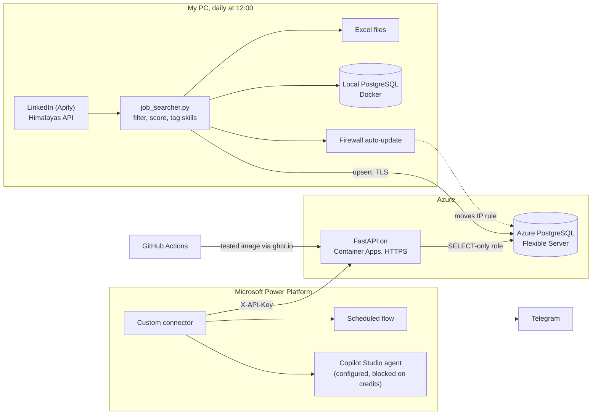

# JobPilot

A personal job-market platform. Every day it collects internship and junior tech jobs, scores each one against my CV and tracks which skills are in demand.
The best new matches arrive on my phone through a Microsoft Power Platform flow, served by a read-only API on Azure.

Built by directing AI coding agents (Claude Code) through planning, review and testing; I designed the architecture and reviewed every step.

[](https://github.com/kaankababulut/jobpilot/actions/workflows/ci.yml)

| | |
|---|---|
| Jobs in the database | **487**, no duplicates |
| Automated tests | **390** (327 default + 63 database), run in CI on every pull request |
| Cloud load time | **4 min → 19 s** after batching database round trips |
| Running cost | **$0/month** on Azure free tiers, with a $5 budget alert |

**Tech stack:** Python, PostgreSQL 17 (pgvector), psycopg 3, FastAPI, pytest, Docker, GitHub Actions, Azure Container Apps, Azure Database for PostgreSQL, Entra ID, Power Platform (custom connector, Power Automate, Copilot Studio), Telegram Bot API.

## How it works



1. **Collect.** Windows Task Scheduler runs `job_searcher.py` at 12:00. For each title in `config.json` it searches LinkedIn (through Apify) for remote jobs worldwide and in the EU plus all jobs in Türkiye, and Himalayas for remote jobs open to applicants in Türkiye. If every source fails with a network error, it retries the whole round up to 3 times.
2. **Filter and score.** It drops senior, non-tech and non-remote postings, unpaid or pay-to-join internships and job aggregators. It marks whether I can actually apply (a "remote" LinkedIn job listed under a country usually needs residence there), detects the skills each posting asks for and scores the match against my CV skills.
3. **Store.** It writes the daily and 30-day Excel files, then upserts the same 30-day window into the local PostgreSQL database and into Azure PostgreSQL. Each load fails safe on its own: a database outage logs one warning and the run carries on.
4. **Serve.** A read-only FastAPI service on Azure Container Apps exposes the data over HTTPS with an API key. It logs in as a SELECT-only database role.
5. **Notify.** At 13:30 a Power Automate flow calls the API through a custom connector, checks that today's load arrived and sends my best new matches (score 70+, up to 10) to Telegram.

## What this project demonstrates

| Area | In this repo |
|------|--------------|
| Data engineering | Idempotent, order-independent upserts on a natural key; numbered SQL migrations with a small tested runner; batched (pipelined) loads to a remote database; fail-safe daily loads |
| Backend | FastAPI with API-key auth that fails closed; read-only enforced in the SQL, the session and the database role; paging; an OpenAPI contract written for LLM tools |
| DevOps and cloud | Docker and Docker Compose; GitHub Actions CI with a real Postgres; immutable commit-tagged images; Azure Container Apps and managed PostgreSQL; a least-privilege Entra ID service principal; budget alert, scale to zero and a 1-replica cap |
| Microsoft Power Platform | Custom connector imported from a generated Swagger 2.0 spec; scheduled Power Automate flow with a freshness check; Copilot Studio agent grounded only on API tools |
| Testing | 390 pytest tests; database tests in a throwaway schema; snapshot tests that fail if the API contract drifts |

## Repository layout

| Path | Purpose |
|------|---------|
| `job_searcher.py` | Entry point of the daily run: fetch, filter, score, write Excel, load the databases |
| `config.json` | Search titles, regions, filters and my CV skills |
| `jobpilot/records.py` | Maps one Excel row to a database record (pure, no database) |
| `jobpilot/db.py` | Batched upserts and `safe_load`, which never breaks the daily run |
| `jobpilot/backfill.py` | Loads existing Excel files into a database |
| `jobpilot/migrate.py`, `db/migrations/` | Schema as numbered SQL files and the runner that applies them |
| `jobpilot/queries.py`, `jobpilot/api.py` | The API's read-only SQL and the FastAPI app |
| `jobpilot/openapi2.py` | Converts the OpenAPI 3.1 contract to Swagger 2.0 for Power Platform |
| `jobpilot/azure_firewall.py` | Points the Azure firewall rule at today's IP before the cloud load |
| `docs/openapi.json`, `docs/openapi-v2.json` | API contract snapshots, checked by tests |
| `tests/` | pytest suite (default and database tests) |
| `Dockerfile`, `docker-compose.yml` | API image; local PostgreSQL with pgvector |
| `.github/workflows/ci.yml` | CI: tests, migrations on a fresh database, database tests, image build on `main` |

## Run it yourself

Requirements: Python 3.14 (the version CI uses), Docker Desktop.

```bash
python -m pip install -r requirements.txt
cp .env.example .env              # set POSTGRES_PASSWORD and DATABASE_URL (use 127.0.0.1, not localhost)
docker compose up -d              # local PostgreSQL 17 + pgvector, bound to 127.0.0.1
python -m jobpilot.migrate        # create the schema (re-run after new migrations)
python -m jobpilot.backfill       # load Excel files from output/ (safe to re-run)
```

Tests:

```bash
python -m pytest -q               # 327 default tests: no network, no Docker
python -m pytest -q -m db         # 63 database tests in a throwaway schema (needs the container)
```

API, locally:

```bash
python -c "import secrets; print(secrets.token_urlsafe(32))"   # put it in .env as JOBPILOT_API_KEY
uvicorn jobpilot.api:app --host 127.0.0.1 --port 8000
```

Open <http://127.0.0.1:8000/docs>, click **Authorize** and paste the key. Without a key set, data endpoints answer 503; with a wrong key, 401.

| Endpoint | Key? | Returns |
|----------|------|---------|
| `GET /health` | no | `{"status": "ok"}`; never touches the database |
| `GET /jobs` | yes | Jobs, best match first; filters `open_to_you`, `min_score`, `skill`, `work_type`, `source`, `since`, `q`; paging with `has_more` |
| `GET /jobs/{job_id}` | yes | One job with description, red flags and skills |
| `GET /skills` | yes | Most-demanded skills in the last `days` days, with share of jobs and `on_cv` |
| `GET /runs` | yes | Latest database loads |

If you change an endpoint, regenerate the contracts with `python -m jobpilot.api --write` and `python -m jobpilot.openapi2 --write`.

The scraper itself (`python job_searcher.py`) needs an `APIFY_TOKEN` environment variable and costs about $0.45 of Apify credit per run. Everything above works without it, on Excel files you already have.

## Data model

| Table | One row per | Key points |
|-------|-------------|------------|
| `jobs` | job posting | Surrogate `id`; `UNIQUE (source, source_id)`; `first_seen` / `last_seen`; `match_score`, `open_to_you` |
| `skills` | skill | `category`; `on_cv` refreshed from `config.json` on every load |
| `job_skills` | job–skill pair | Skill trends are a `GROUP BY` |
| `runs` | load | Daily or backfill; rows offered and written |
| `schema_migrations` | applied migration | Version, name, `applied_at` |

Migration 002 adds the role `jobpilot_api`: `SELECT` on the four data tables only, read-only by default, at most 5 connections.

## Design decisions

The five I'd defend first. The full list, with what I rejected each time, is in [docs/DESIGN_DECISIONS.md](docs/DESIGN_DECISIONS.md).

**Idempotent, order-independent upserts.** A job is identified by `(source, source_id)` with a `UNIQUE` constraint, so loading the same file twice can't create duplicates. The upsert only overwrites when the incoming data is at least as new (`WHERE jobs.last_seen <= EXCLUDED.last_seen`), so a late backfill of old files can't roll values back. Rejected: delete-then-insert, which loses history and breaks foreign keys.

**Fail safe in the daily run.** Each database load is one transaction with connect and statement timeouts. On any error it rolls back, logs one line with the password redacted and returns. Excel is always written. Because every run loads the full 30-day window, a missed day fills itself the next day.

**Read-only in three layers.** The API code only runs parameterised `SELECT`s; its sessions are opened read-only; and in Azure it logs in as a role that has only `SELECT` privileges. A session setting can be switched off by a client; a missing privilege can't.

**Batched upserts for a remote database.** Row by row, each job cost about 4 network round trips: fine on localhost, slow across the internet. Pipelined `executemany` plus one `unnest` insert for the skill links cut a batch to about 16 round trips. The Azure load went from 4 minutes to 19 seconds.

**An open-to-Azure firewall, with compensating controls.** Container Apps on the Consumption plan uses a shared pool of about 170 outbound IPs, more than the firewall's rule limit. A fixed IP or a private endpoint would break the $5 budget. So the database allows Azure services and relies on long random passwords, TLS and the SELECT-only role, and my home IP rule is updated by a service principal whose custom role can change firewall rules on that one server and nothing else. In production I'd use VNet integration and a private endpoint.

## Further reading

- [docs/AZURE_DEPLOY.md](docs/AZURE_DEPLOY.md): Azure resources, deploy and rollback, secrets and rotation, cost guardrails, kill switch, firewall auto-update.
- [docs/COPILOT_STUDIO.md](docs/COPILOT_STUDIO.md): the Power Platform custom connector, the daily Telegram flow and the Copilot Studio agent, step by step.
- [docs/DESIGN_DECISIONS.md](docs/DESIGN_DECISIONS.md): every design decision, grouped by roadmap step.
- [learning_log.md](learning_log.md): skills practised, with the file or commit as evidence.
- [docs/openapi.json](docs/openapi.json): the API contract.

## Roadmap

1. ✓ Git, AI agent workflow, tests, Docker PostgreSQL
2. ✓ Load jobs into PostgreSQL with idempotent upserts; Excel kept as an export
3. ✓ API foundation: SQL migrations, read-only FastAPI with an API key, GitHub Actions CI
4. ✓ Deploy to Azure on free tiers (Container Apps, PostgreSQL Flexible Server, SELECT-only role, budget alert)
5. Partly done: Power Platform custom connector and daily Telegram flow are live; the Copilot Studio agent is configured but waits for credits
6. Power BI dashboard: skill trends, Microsoft-skill demand, match quality
7. Embeddings with pgvector and semantic search; full descriptions
8. Custom LLM matching agent (Claude tool use) and an MCP server over the same API
9. Agent evals: answer quality, hallucinated skills, cost per query; Copilot Studio vs the custom agent
10. Polish; a web frontend if it serves the goal
