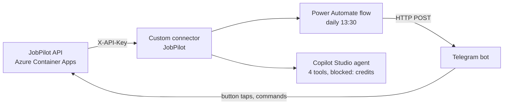

# Microsoft Power Platform: connector, daily alert, Copilot Studio agent (roadmap step 5)

**Status (2026-10-05):** the custom connector and the daily Telegram alert work; the job list arrives every day. The Copilot Studio agent is configured and saved, but the test chat is blocked by "This environment is out of credits". Cost so far: $0.

**Update (2026-10-08):** the application tracker is coded: 👍/👎/✅ buttons in the alert and `/apps`, `/s`, `/add` commands, handled by the API's Telegram webhook. Setup: [AZURE_DEPLOY.md → Tracker setup](AZURE_DEPLOY.md#tracker-setup), then [section 7](#7-tracker-buttons-in-the-daily-alert).



Everything in Microsoft's cloud reaches the data through one custom connector over the deployed, read-only API. That's why the API went to Azure first: Microsoft's cloud can't call localhost.

Contents: [1 Identity](#1-identity-a-work-user-and-a-separate-browser-profile) · [2 Environment](#2-environment-and-solution) · [3 Connector](#3-custom-connector) · [4 Telegram bot](#4-telegram-bot) · [5 Flow](#5-flow-jobpilot-daily-alert) · [6 Agent](#6-copilot-studio-agent) · [7 Tracker buttons](#7-tracker-buttons-in-the-daily-alert) · [Costs](#costs) · [Secrets](#secret-handling) · [Troubleshooting](#troubleshooting)

## 1. Identity: a work user and a separate browser profile

1. Copilot Studio trials reject personal Microsoft accounts. Create a work user in my own Entra tenant: Entra admin center → **Users** → **New user** → `kaan@<tenant>.onmicrosoft.com`. No paid licences are assigned.
2. Sign in as that user once and set up MFA with Microsoft Authenticator.
3. Edge → **Profiles** → **Add profile**, and use it only for this user. Don't use a private window: it blocks third-party cookies, and that hid the connector's actions in the flow designer.

## 2. Environment and solution

1. As the work user, sign up for the free **Power Apps Developer Plan**. It creates a developer environment automatically.
2. Power Apps (make.powerapps.com) → pick that environment → **Solutions** → **New solution**: name `JobPilot`, a new publisher with prefix `kaan`.
3. Create the connector and the flow from inside this solution, so they can be exported and moved together later.

## 3. Custom connector

FastAPI emits OpenAPI 3.1; Power Platform imports Swagger 2.0. `python -m jobpilot.openapi2 --write` converts the API's spec to `docs/openapi-v2.json` (a snapshot test keeps the file in sync). The converter fails loudly on anything 2.0 can't express.

1. Solution `JobPilot` → **New** → **Automation** → **Custom connector** → **Import an OpenAPI file** → `docs/openapi-v2.json` → name `JobPilot`.
2. **General:** host and base URL come from the file (the live API, `https`). **Leave "Connect via on-premises data gateway" unticked** (see [Troubleshooting](#troubleshooting)).
3. **Security:** API Key, parameter label `X-API-Key`, parameter name `X-API-Key`, location **Header**.
4. **Definition:** check there are 6 actions: `health`, `list_jobs`, `get_job`, `top_skills`, `recent_runs`, `list_applications` (the last one since the tracker; an older connector has 5, see [section 7](#7-tracker-buttons-in-the-daily-alert)).
5. **Create connector**, then **Test** → **New connection** → paste the cloud API key (`JOBPILOT_CLOUD_API_KEY` in `.env`) → name the connection `JobPilot Cloud`. The key is stored once, encrypted, in the connection; flows and the agent reference the connection, never the key.
6. Test `health` (no key needed), then `recent_runs`. Both should answer 200. The first call after an idle period can be slow: the API scales to zero.

## 4. Telegram bot

Email, Teams and mobile push didn't work on a free tenant (see [Dead ends](#notification-dead-ends)), so the alert goes to Telegram.

1. In Telegram, message **@BotFather** → `/newbot` → pick a name and a username. BotFather replies with a token.
2. Put the token in `.env` as `TELEGRAM_BOT_TOKEN`. Never paste it in a chat, a screenshot or a commit.
3. Send any message to the new bot, then get the chat id without printing the token:

   ```powershell
   # PowerShell, from the project folder: prints only the chat id(s)
   $t = (Select-String -Path .env -Pattern '^TELEGRAM_BOT_TOKEN=(.*)$').Matches[0].Groups[1].Value.Trim()
   (Invoke-RestMethod "https://api.telegram.org/bot$t/getUpdates").result.message.chat.id | Sort-Object -Unique
   Remove-Variable t
   ```

   Below, `<token>` is the bot token and `<chat_id>` is that number.

## 5. Flow "JobPilot daily alert"

Solution `JobPilot` → **New** → **Automation** → **Cloud flow** → **Scheduled**.

| # | Step | Settings |
|---|------|----------|
| 1 | **Recurrence** | Every 1 day, at 13:30, time zone **(UTC+03:00) Kuwait, Riyadh**. Istanbul isn't in the list; Türkiye is UTC+3 all year, so the time never shifts. 13:30 leaves margin after the 12:00 run. |
| 2 | **health** (connector) | Warm-up call that wakes the API. Settings → Retry policy **None**. |
| 3 | **Compose** `today` | `formatDateTime(convertFromUtc(utcNow(),'Turkey Standard Time'),'yyyy-MM-dd')` |
| 4 | **recent_runs** (connector) | `limit` = 1. **Run after:** health *is successful*, *has failed*, *has timed out*, so a slow wake-up doesn't stop the flow. |
| 5 | **Compose** `latest_date` | `first(body('recent_runs')?['items'])?['run_date']` |
| 6 | **Compose** `latest_kind` | `first(body('recent_runs')?['items'])?['kind']` |
| 7 | **Condition** | `latest_date` *is equal to* `today` **AND** `latest_kind` *is equal to* `daily`. Pick both Compose outputs as **dynamic content** (lightning icon). Typed as plain text, they are compared as literal strings and the condition is always false. |
| 7-no | **HTTP** | Telegram message "today's load is missing" (body below). |
| 7-yes | **list_jobs** (connector) | `since` = output of `today`, `open_to_you` = true, `min_score` = 70, `limit` = 10. |
| 8 | **Condition 2** | `length(body('list_jobs')?['items'])` *is greater than* 0 |
| 8-yes | **Select** | From `body('list_jobs')?['items']`; switch Map to **text mode**: `concat('• ', item()?['match_score'], ' · ', item()?['title'], ' @ ', coalesce(item()?['company'],'?'), ' ', item()?['apply_url'])` |
| 8-yes | **HTTP** | Telegram message with the list (body below). |
| 8-no | **HTTP** | Telegram message "no new matches". |

Every **HTTP** action:

- Method `POST`, URI `https://api.telegram.org/bot<token>/sendMessage`, header `Content-Type: application/json`.
- Body as an expression, so the text is escaped correctly as JSON:
  `addProperty(addProperty(json('{}'),'chat_id',<chat_id>),'text', <text>)`
- For the list, `<text>` is a `concat(...)` of a heading and `join(body('Select'), <line break>)`. For the other two it's a fixed sentence.
- Settings → **Secure Inputs: On**. The token is in the URL; this hides it from the run history.

Test with **Test** → **Manually**. Expected: one Telegram message, and every step green (or the "no" branch on a day without a load).

## 6. Copilot Studio agent

1. Start the Copilot Studio trial explicitly first, as the work user: the Microsoft Copilot Studio pricing page on microsoft.com → **Try for free** → business form, no payment. Without it, saving the agent fails with "User license not found".
2. copilotstudio.microsoft.com → same developer environment → **Create** → **New agent** → name `JobPilot Career Assistant`.
3. Settings: **generative orchestration** on, default model, **web search off**, no knowledge sources, no skills.
4. **Instructions:** paste the text from [docs/step5/agent_instructions.md](step5/agent_instructions.md).
5. **Tools** → **Add a tool** → **Connector** → `JobPilot` → add `list_jobs`, `get_job`, `top_skills`, `recent_runs` (not `health`: it carries no data). Authentication: **maker-provided credentials**, using the `JobPilot Cloud` connection, so chat users never see or enter a key.
6. **Save.** Don't publish: publishing needs a channel and consumes credits.

### Current blocker: credits

The test chat answers "This environment is out of credits" (error code `EnforcementUsageCredits`). No billing plan or pay-as-you-go subscription is linked, on purpose. Next: ask a Microsoft-partner contact about credit allocation or a demo tenant. If that doesn't work, the AI agent is built in roadmap step 8 (Claude tool use) over the same API, and the [test questions](step5/agent_instructions.md#test-questions) carry over to the step 9 evals.

## 7. Tracker buttons in the daily alert

Each job in the alert gets a row of three buttons: 👍, 👎 and ✅ (applied). A tap goes from Telegram straight to the API's webhook (`POST /telegram/webhook`), not through the flow. Do this edit after the webhook is set up ([AZURE_DEPLOY.md → Tracker setup](AZURE_DEPLOY.md#tracker-setup)); before that, taps go nowhere.

**Callback data.** Each button carries a short string that the webhook parses (`jobpilot/telegram.py`): `u:<job_id>` for 👍, `d:<job_id>` for 👎, `a:<job_id>` for ✅. `<job_id>` is the `id` field from `list_jobs`, with no leading zero and nothing else around it. Anything else is ignored. Telegram's limit is 64 bytes per button, far more than this needs.

**Edit the flow.** In the 8-yes branch:

1. Change the existing **Select** so each line starts with the job id, which the buttons show too:
   `concat('#', item()?['id'], ' • ', item()?['match_score'], ' · ', item()?['title'], ' @ ', coalesce(item()?['company'],'?'), ' ', item()?['apply_url'])`
2. Add a second **Select**, named `keyboard`, after it. From: `body('list_jobs')?['items']`. Switch Map to **text mode** and enter this expression, which builds one row of three buttons per job:

   ```
   createArray(
     json(concat('{"text":"👍 #', string(item()?['id']), '","callback_data":"u:', string(item()?['id']), '"}')),
     json(concat('{"text":"👎 #', string(item()?['id']), '","callback_data":"d:', string(item()?['id']), '"}')),
     json(concat('{"text":"✅ #', string(item()?['id']), '","callback_data":"a:', string(item()?['id']), '"}'))
   )
   ```

   The output, `body('keyboard')`, is an array of rows: exactly Telegram's `inline_keyboard` shape. Building the JSON from strings is safe here because the id is a number; the job title stays in the message text, which `addProperty` escapes.
3. In the HTTP action that sends the list, add `reply_markup` to the body expression:
   `addProperty(addProperty(addProperty(json('{}'),'chat_id',<chat_id>),'text',<text>),'reply_markup',addProperty(json('{}'),'inline_keyboard',body('keyboard')))`

   The other two messages ("today's load is missing", "no new matches") have no jobs, so they stay as they are.

The body Telegram receives, for two jobs (placeholder ids):

```json
{
  "chat_id": <chat_id>,
  "text": "Today's best matches:\n#101 • 85 · Data Intern @ ExampleCo https://...\n#102 • 72 · Junior Developer @ ? https://...",
  "reply_markup": {
    "inline_keyboard": [
      [{"text": "👍 #101", "callback_data": "u:101"}, {"text": "👎 #101", "callback_data": "d:101"}, {"text": "✅ #101", "callback_data": "a:101"}],
      [{"text": "👍 #102", "callback_data": "u:102"}, {"text": "👎 #102", "callback_data": "d:102"}, {"text": "✅ #102", "callback_data": "a:102"}]
    ]
  }
}
```

Test with **Test** → **Manually**: the list arrives with 10 rows of buttons at most. A tap shows a short toast: "Saved 👍", "Saved 👎", "Marked as applied ✅" or "Already applied". A spinner that never stops means the webhook didn't answer: see the end of the Tracker setup runbook.

**Commands.** In the same chat: `/apps` lists open applications, `/s <id> <status> [note]` updates one (statuses: applied, assessment, interview, offer, rejected, withdrawn), `/add Company | Title | URL` tracks an application made elsewhere (URL optional), `/help` shows the list. The `<id>` in `/s` is the application number from `/apps`, not the job id.

**For the agent.** After the connector update (Tracker setup step e) there is a sixth action, `list_applications` (filters `status` and `open`). In Copilot Studio → `JobPilot Career Assistant` → **Tools** → **Add a tool** → **Connector** → `JobPilot` → `list_applications`, with the same maker-provided `JobPilot Cloud` connection. It is read-only, like the other tools, so the agent can answer "which applications are still open?" but can't change anything. Its `recorded_via` field says how a row was recorded; `source` in `list_jobs` is the job board.

## Costs

Step 5 cost **$0**: the Developer Plan, the Copilot Studio trial and Telegram are free, and the flow's API calls stay inside the Azure free grant.

The Developer Plan is meant for building and testing, not production use. These would cost money and are not set up:

- **Publishing the agent** to a channel (Teams, a website): every answer consumes Copilot Studio credits.
- **Pay-as-you-go billing** linked to an Azure subscription: it would bill credits and premium usage to the card.
- **Licences:** Copilot Studio, Power Automate Premium (custom connectors and the HTTP action are premium outside the Developer Plan), and Microsoft 365 for Outlook and Teams.

## Secret handling

| Secret | Lives in | Never |
|--------|----------|-------|
| Cloud API key | `.env` (`JOBPILOT_CLOUD_API_KEY`) and the encrypted connection `JobPilot Cloud` | in the connector definition, the flow or the agent instructions |
| Telegram bot token | `.env` (`TELEGRAM_BOT_TOKEN`) and the flow's HTTP URIs, with Secure Inputs on | in a chat, a screenshot or git |
| Telegram chat id | the HTTP bodies | in docs (written `<chat_id>`) |

- Never screenshot the connector's **Test** tab (the request shows the `X-API-Key` header) or the Container App's **Secrets** page.
- Secure Inputs only hides values from the run history. The flow definition still contains the token, so treat an exported solution as secret.
- If the token leaks: @BotFather → `/revoke`, then update `.env` and every HTTP URI. If the API key leaks: rotate it (README → Secrets), then edit the `JobPilot Cloud` connection.

## Troubleshooting

| Error or symptom | Cause | Fix |
|------------------|-------|-----|
| Every connector call fails at once with 500 "Setting 'gateway' cannot be null" (source `gatewayconnector`) | "Connect via on-premises data gateway" was ticked on the connector's General tab | Untick it, **Update connector**, then delete and recreate the `JobPilot Cloud` connection (the old one keeps the gateway setting) |
| Connector actions don't appear in the flow designer | Private window: third-party cookies blocked | Use the separate Edge profile |
| The date Condition is always false | Values typed as text, so the condition compares literal strings | Pick the Compose outputs as dynamic content |
| First connector call slow or timed out | Cold start: the API scales to zero | The `health` warm-up plus run-after on `recent_runs` handles it |
| Personal Microsoft account rejected for the Copilot Studio trial | Trials need a work or school account | Work user in my own tenant |
| "User license not found" when saving the agent | The Copilot Studio trial wasn't started | Start it from the pricing page (**Try for free**) as the work user |
| "This environment is out of credits" (`EnforcementUsageCredits`) in the test chat | No credits in this environment; no billing plan linked | Open: see [Current blocker](#current-blocker-credits) |

### Notification dead ends

| Tried | Result |
|-------|--------|
| Mail connector ("Send an email notification") | "restricted for new tenants" |
| Outlook.com connector | connection fails with Unauthorized |
| "Send me a mobile notification" | fails: the Power Automate mobile app was retired on 31 Aug 2026 |
| Office 365 Outlook, Microsoft Teams | need a paid licence |
| Discord webhook | Discord is blocked in Türkiye |
| Gmail (consumer account) | can't be combined with custom connectors in one flow |
| **Telegram bot, HTTP action** | **works** |

The earlier Excel-based agent (Microsoft 365 Agent Builder) is archived in `docs/archive/COPILOT_AGENT_SETUP.md`. That file holds personal details, so it stays local and git-ignored.
